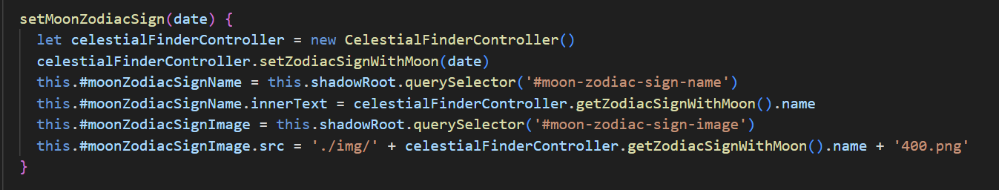

## Reflektioner - ZodiacCompanion
Fredrik Svensson (fs222id) - 1DV610
 
### 2. Meaningful Names
Namngivningen av både klasser och funktioner har funderats igenom och förändrats en del under resans gång. Till exempel gick jag från typen "actual-zodiac" till "astronomical-zodiac", bland annat då jag använder "current-zodiac" och skillnaden actual och current kändes luddig (Make Meaningful Distinctions). Dock blir det inte helt bra när jag lagt till även månen, som fick namn av typen "moon-zodiac". Kanske är det ännu tydligare med "solar-astronomical-zodiac" och "lunar-astronomical-zodiac".

Ett annat exempel, som visas nedan, handlar om gränser. I klasserna för stjärntecknen har jag använt "lowerBoundary" och "upperBoundary" för de punkter där stjärnbilderna enligt definition skär ekliptikan, den (ungefärliga) bana som solen och planeterna ser ut att följa runt jorden. Egentligen är det lite märkligt att tala om övre och undre när det handlar om positioner på en sfär (eller cirkel) vilket blir extra tydligt för den stjärnbilden som ligger på båda sidor om noll, där övre värdet alltså är lägre än det undre. Dock kan det kanske ses som ett försök att använda lösningsorienterade namn (Use Solution Domain Names).

### 3. Functions
Att ha funktioner som gör endast en sak (Do One Thing) är för mig bland de svåraste sakerna rent praktiskt. Troligen för att det förändrar det sätt som jag har skrivit kod på i grunden. Samtidigt är det effektivt och lättöverskådligt, åtminstone tycker jag det i exemplet med DateValidator, den klass med funktioner som kontrollerar om datumet är giltigt.

Motsatsen är delar av koden i modulen, där arbete pågår med att dels sätta beräkningar i egna klasser och dels dela upp dem i mycket mindre delar. Den följer dock 

En annan sak kring funktioner som jag arbetar annorlunda med är argument, där jag i större utsträckning försöker få ner antalet. Även här är datumvalideringen ett bra exempel där datumobjektet sätts som en privat instansvariabel och genast blir tre funktioner niladiska. Dock har jag svårt att komma runt tre argument vid kontroll om antalet dagar i en månad ett visst år stämmer. 

### 4. Comments
Jag har försökt få koden att stå för sig själv och undvika redundanta kommentarer. Till undantagen kan räknas en inledande, kort kommentar till varje klass. Men dessa ser jag mer som ett sätt att deklarera syfte (Explanation of Intent) och sedan, förhoppningsvis, hålla sig till det.

Dock har jag känt att eftersom javascripts inbyggda objekt för datum och tid, Date(), har vissa egenheter bör dessa få en förtydligande kommentar för att lyfta vikten (Amplification) av en till synes märklig operation. I exemplet nedan visar kommentaren att det ligger en tanke bakom både att sätta året till 2000 och att tiden ska vara midnatt, för att undvika problem med jämförese när Date() sätter tid beroende på tidszon. Detta hade ytterligare kunnat förklaras i kommentar, men gör sig nog bättre i annan dokumentation. 

### 5. Formatting
När det gäller formatering tycker jag att mycket löser sig självt när en använder korta klasser och funktioner. Men då jag har valt att skriva min app med webbkomponenter blir det ibland lite längre, och betydelsen av bra formatering ökar.

Ett exempel är vikten av att hålla vertikala avstånd korta (Vertical Distance). Både när det gäller avstånd mellan att variabler deklareras (Variable Declarations) och när de används. Detsamma gäller även, som i exemplet nedan, för HTML-elementen. Istället för att gruppera querySelector så används de på följande rad.

I exemplet syns även ett exempel på variabel som kan flyttas högre upp (Instance variable), då den används i en annan funktion och nu bryter mot DRY.

### 6. Objects and Data Structure
Jag tror att jag balanserar på gränsen till att "blithely add getters and setters". I många fall har jag lagt till dem utan närmare eftertanke, å andra sidan är appen så pass begränsad att det inte finns så mycket data att hämta. 

Om jag tolkar boken rätt är mina klasser för stjärntecknen en form av datastrukturer. De innehåller inga funktioner, och används för att skapa en lista med objekt att iterera igenom. 

### 7. Error Handling
Det finns mycket att säga om felhantering, eller frånvaron av den (som i exemplet nedan). UPPDATERAD: Valde att prioritera just den biten på slutet och införde en try-catch.

En av dessa handlar om att undvika null (Don't Return Null). I tidiga versioner av appen gjordes detta på flera ställen. Men i nuläget sker det bara på ett ställe. Det är när jag definierar data för den trettonde zodiaken, Ophiuchus. Den finns inte med bland de tecken som delar året i tolv delar, men är en stjärnbild som solen rör sig framför. Den behöver alltså finnas med i iterationen, men kan inte ha värden vad gäller start- och slutdatum. Dessa har jag därför valt att sätta till null.

### 8. Boundaries
Gränser hanteras enligt boken genom att ha så få som möjligt av dem. I min app är den enda gränsen den mot min modul (Clean Boundaries). Den förekommer i en klass, och det enda appen behöver veta är att den kräver ett datum, formaterat på ett visst sätt, och en tidpunkt (som hårdkodats till noll). I gengäld får appen positioner som anges enligt ett givet format.

### 9. Unit Tests
Tyvärr har jag inte arbetet testdrivet, åtminstone inte enligt TDD. I verkligheten har min kod stundom varit så nerlusad med console.log att det hade gått väsentligt fortare att sakta ner och skriva några enhetstester. Exemplet nedan hade hjälpt mycket om jag skrivit det innan, eller åtminstone i anslutning till att jag arbetade med att lösa specialfallet med stjärntecknet som finns både före och efter ett nytt år.

Annars tycker jag att principen om ett koncept per test (Single Concept per Test) låter vettig. Åtminstone om ett koncept även inbegriper specialfall, som mitt exempel.

### 10. Classes
Utöver SRP och eventuella brott mot den principen tycker jag att tankarna kring fokus eller grad av sammanhang (Cohesion) är bra. Att metoderna i möjligaste mån ska använda instansvariablerna. 

I mitt exempel har jag redan i formateringen lagt variablerna i grupper som skvallrar om att de inte egentligen har så mycket med varandra att göra. I koden använder sedan olika metoder de olika variablerna. Hade jag följt principen om fokus hade jag kanske skapat tre klasser, och förutom ökat sammanhang inom klassen fått färre variabler.

### 11. Systems
Mitt system eller övergripande arkitektur lider av att jag i början var så inne i parallellkursen att jag utan att tänka igenom det påbörjade arbetet enligt MVC men fortsatte med att trycka in webbkomponenter utan hänsyn till tänkta beroenden. Önskar att jag läst kapitlets sista mening först: "[..] never forget to use the simplest thing that can possibly work."

Exemplet visar HomeView, som har i uppdrag att ladda in objekt och lägga till dessa på webbsidan som möter användaren. Om jag tolkat boken rätt när det gäller att dela upp konstruktion och användning är det precis vad som sker här (Separation of Main). Dock skulle jag lämpligen lagt detta i klassen app, som inte gör annat än anropar HomeView och slagit samman HomeView med HomePage.

